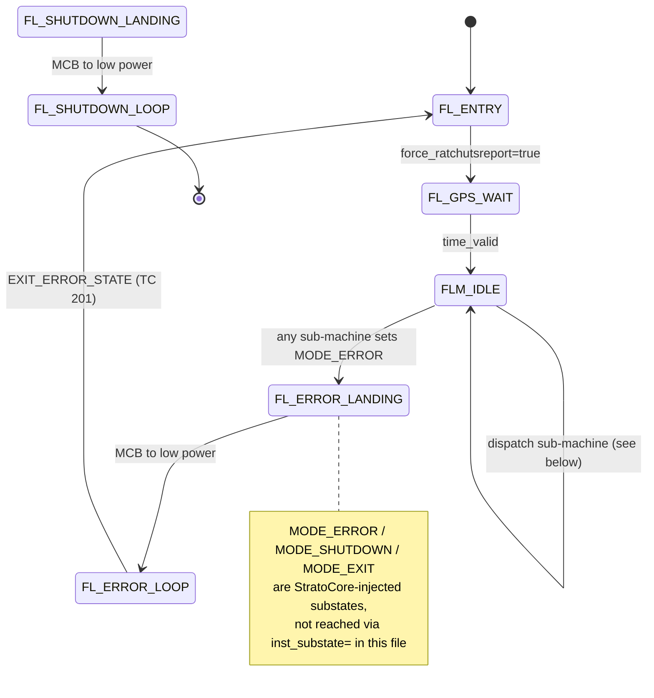
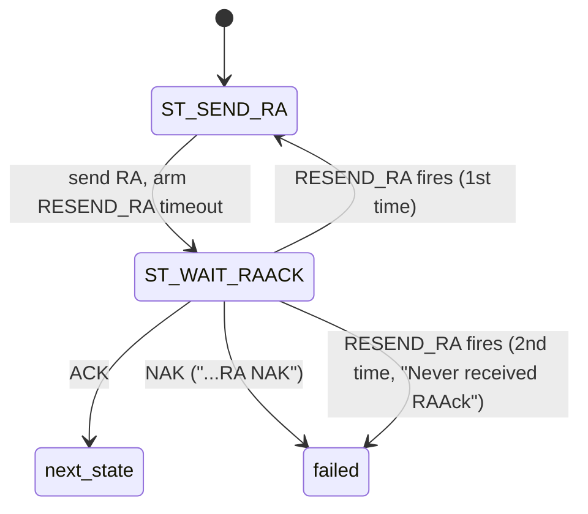
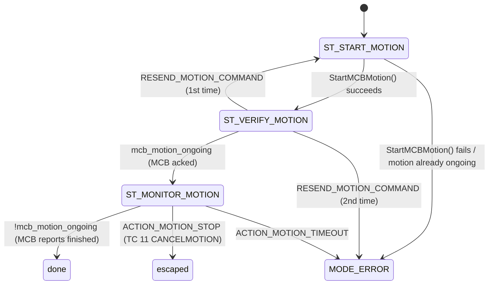
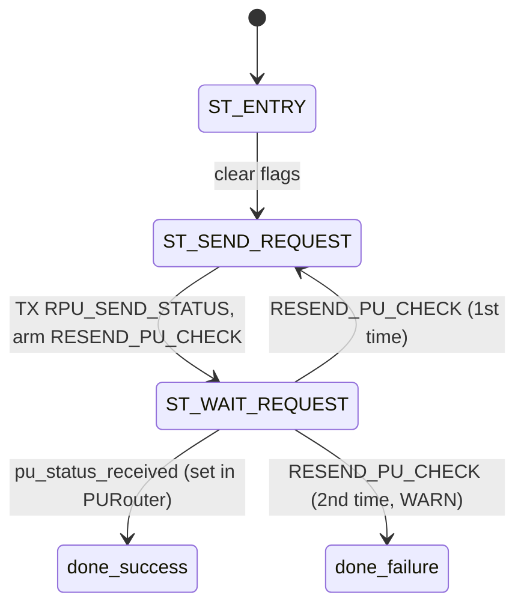
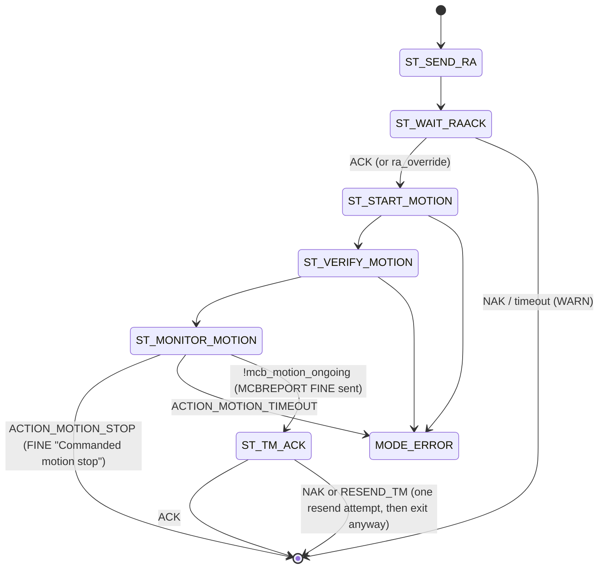
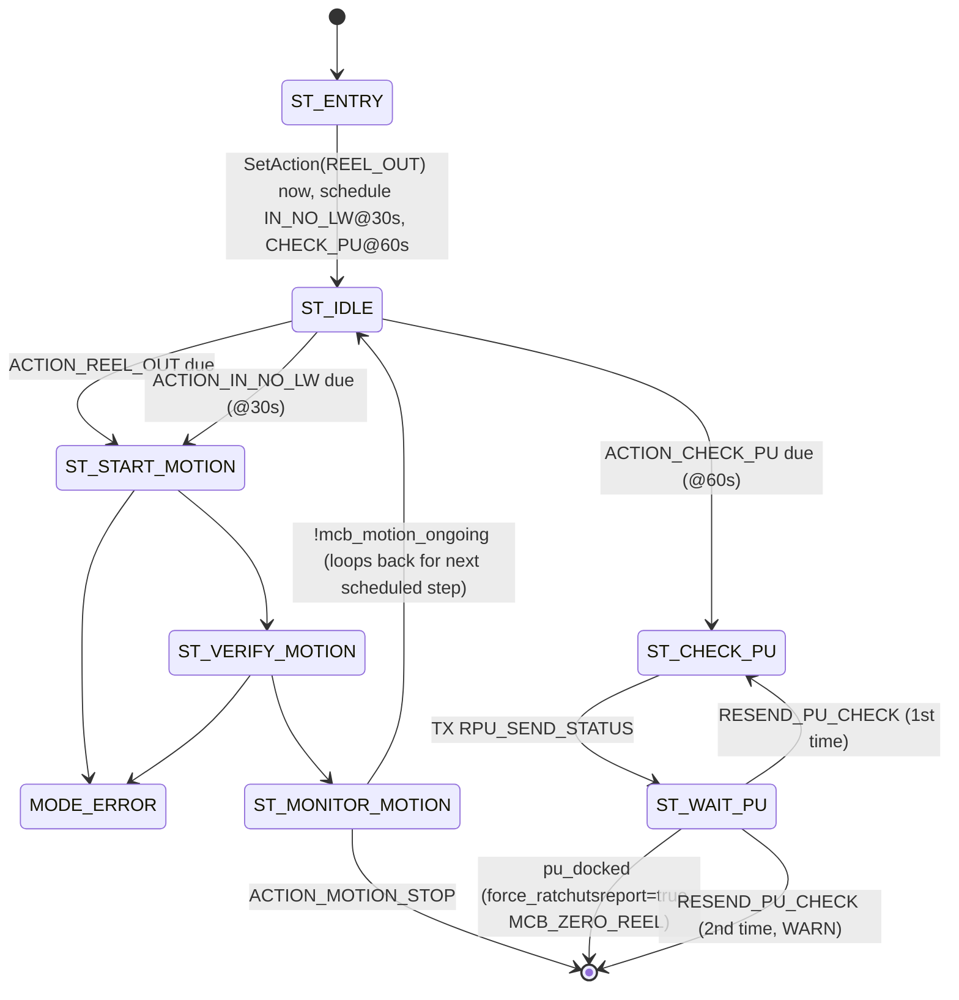
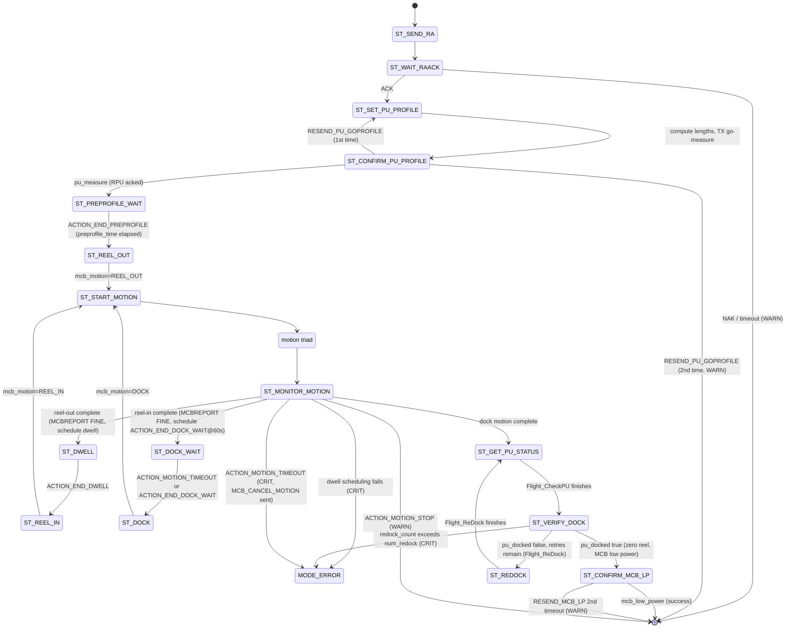
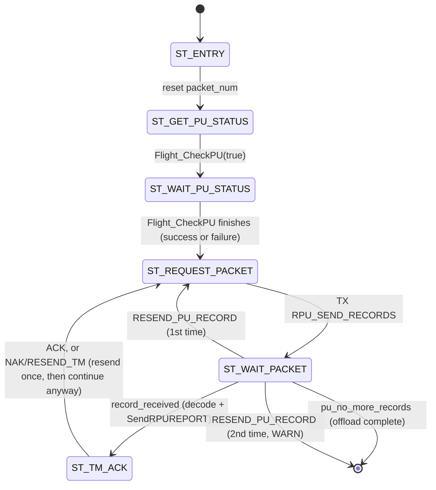

# RACHUTS Flight Mode — Substates and Control Flow

An overview of every substate reachable in `MODE_FLIGHT`, how they nest, and
the handshakes/timeouts that drive transitions. Source: `src/Flight.cpp` and
the per-operation `src/Flight_*.cpp` files. Reflects the post-autonomous-mode
firmware (manual flight is the only flight path — see
`RemoveAutonomousModePlan.md`).

## Architecture

`FlightMode()` is the top-level substate switch dispatched by `StratoCore` once
per loop while `inst_mode == MODE_FLIGHT`. Its `default` case falls through to
`ManualFlight()`, a second switch over the `FLM_*` substates. Six of those
substates each delegate to a dedicated **sub-state-machine function**
(`Flight_CheckPU`, `Flight_ManualMotion`, `Flight_ReDock`, `Flight_Profile`,
`Flight_PUOffload`, `Flight_DockedProfile`), each with its own `static` substate
variable private to its file.

Every sub-state-machine follows the same calling convention:

```cpp
bool Flight_X(bool restart_state);
```

- Called with `restart_state = true` once, when entered, to reset its internal
  state to `ST_ENTRY`.
- Called every loop thereafter with `restart_state = false`.
- Returns `true` when finished (success **or** failure) — the caller then
  transitions back to `FLM_IDLE`. Returns `false` while still running.

This means **the return value alone doesn't indicate success** — callers that
care check a side-effect flag (e.g. `check_pu_success`) or rely on the WARN/CRIT
TM already sent by the sub-machine before it returned `true`.

## Top-level flow (`Flight.cpp`)



| Substate | Value | Purpose |
|---|---|---|
| `FL_ENTRY` | `MODE_ENTRY` (0) | Logs entry, sets `force_ratchutsreport`, advances immediately. |
| `FL_GPS_WAIT` | 1 | Blocks until `time_valid` (first Zephyr GPS message). Every other substate assumes valid time. |
| `FLM_IDLE` … `FLM_DOCKED` | 2–8 | The `FLM_IDLE` routing table, detailed below. |
| `FL_ERROR_LOOP` | 9 | Parking state after a fault. MCB is repeatedly commanded to low power until `EXIT_ERROR_STATE` (TC 201) is received. |
| `FL_SHUTDOWN_LOOP` | 10 | Parking state after a shutdown warning; MCB sent to low power once. |
| `FL_ERROR_LANDING` | `MODE_ERROR` (253) | One-shot: clears the schedule, forces MCB low power, then falls into `FL_ERROR_LOOP`. |
| `FL_SHUTDOWN_LANDING` | `MODE_SHUTDOWN` (254) | One-shot: MCB low power, then falls into `FL_SHUTDOWN_LOOP`. |
| `FL_EXIT` | `MODE_EXIT` (255) | Runs once as StratoCore switches out of Flight; commands MCB low power. |

`FL_ERROR_LOOP` was previously pinned to substate **14** (its historical value,
from when it sat after five now-removed autonomous-only substates), on the
theory that ground tooling/operators might depend on that specific number. That
pin has since been removed — nothing in the firmware itself depends on the
value, and the system is pre-deployment, so the substate is now free to
renumber naturally (**9**, following directly after `FLM_DOCKED`). See
`KnownIssues.md` §11 for a known gap in this area (flight-only TCs silently
no-op while parked in `FL_ERROR_LOOP`, because `RequireFlightMode` only checks
`mode_code == "FL"`).

`SendPeriodicRATCHUTSREPORT()` runs at the very top of `FlightMode()`, before
the substate switch — so it fires every loop regardless of substate, including
inside `FL_ERROR_LOOP`.

## `FLM_IDLE` routing

`FLM_IDLE` is a priority-ordered `if/else if` over pending action flags — only
**one** trigger is picked up per loop, in this order:

### `FLM_*` substate quick reference

| Symbol | Function / File | Description |
|---|---|---|
| `FLM_IDLE` | `ManualFlight()` — `Flight.cpp` | Waits for a pending trigger (action flag); dispatches to the substate below matching whichever one arrived. |
| `FLM_CHECK_PU` | `Flight_CheckPU()` — `Flight_CheckPU.cpp` | Requests a fresh RPU status over the dock link. |
| `FLM_MANUAL_MOTION` | `Flight_ManualMotion()` — `Flight_ManualMotion.cpp` | Drives a single direct reel command — reel in, reel out, or dock. |
| `FLM_REDOCK` | `Flight_ReDock()` — `Flight_ReDock.cpp` | Recovers to a known dock state via a scheduled reel-out/reel-in/PU-check sequence. |
| `FLM_PU_OFFLOAD` | `Flight_PUOffload()` — `Flight_PUOffload.cpp` | Pulls stored profile records off the RPU in batches. |
| `FLM_PROFILE` | `Flight_Profile()` — `Flight_Profile.cpp` | Runs a full manual profile — RA, PU measure, reel out, dwell, reel in, dock, redock-if-needed. |
| `FLM_DOCKED` | `Flight_DockedProfile()` — `Flight_DockedProfile.cpp` | Measures with the RPU while docked, without any reel motion. |

| Priority | Action flag | Set by (TC) | Starts | Next substate |
|---|---|---|---|---|
| 1 | `ACTION_REEL_IN` | 4 `RETRACTx` | `Flight_ManualMotion` (`MOTION_REEL_IN`) | `FLM_MANUAL_MOTION` |
| 2 | `ACTION_REEL_OUT` | 1 `DEPLOYx` | `Flight_ManualMotion` (`MOTION_REEL_OUT`) | `FLM_MANUAL_MOTION` |
| 3 | `ACTION_DOCK` | 7 `DOCKx` | `Flight_ManualMotion` (`MOTION_DOCK`) | `FLM_MANUAL_MOTION` |
| 4 | `ACTION_CHECK_PU` | 143 `GETPUSTATUS` | `Flight_CheckPU` | `FLM_CHECK_PU` |
| 5 | `COMMAND_REDOCK` | 142 `RETRYDOCK` | `Flight_ReDock` (`MOTION_IN_NO_LW` first) | `FLM_REDOCK` |
| 6 | `COMMAND_MANUAL_PROFILE` | 146 `MANUALPROFILE` | `Flight_Profile` | `FLM_PROFILE` |
| 7 | `ACTION_OFFLOAD_PU` | 147 `OFFLOADPUPROFILE` | `Flight_PUOffload` | `FLM_PU_OFFLOAD` |
| 8 | `COMMAND_DOCKED_PROFILE` | 153 `DOCKEDPROFILE` | `Flight_DockedProfile` | `FLM_DOCKED` |

Each `FLM_*` substate (other than `FLM_IDLE`) just re-calls its sub-machine
every loop with `restart_state = false` until it returns `true`, then goes back
to `FLM_IDLE`:

```cpp
case FLM_MANUAL_MOTION:
    if (Flight_ManualMotion(false)) {
        inst_substate = FLM_IDLE;
    }
    break;
```

`FLM_CHECK_PU` is the one exception with extra logic: on success it also sets
`force_ratchutsreport = true` so a fresh status report goes out promptly
without blocking on the periodic timer.

`CANCELMOTION` (TC 11) is handled outside this table — it sets
`ACTION_MOTION_STOP`, which `Flight_ManualMotion`, `Flight_ReDock`, and
`Flight_Profile` all poll for independently inside their own "monitor motion"
states (see below), and it also unconditionally sends `MCB_CANCEL_MOTION` to the
MCB regardless of mode/substate.

### Three ways a sub-machine gets invoked

Each sub-machine's section below opens with a "Triggered by" note, but not every
trigger passes through `FLM_IDLE` — and that distinction matters, because
`inst_substate` (what `SENDSTATE`/TC 203 and ground telemetry report) only
changes for the first two:

1. **Ground-commanded, via `FLM_IDLE`.** A telecommand sets an action flag;
   `FLM_IDLE` polls it next loop and calls the matching `Flight_X(true)`,
   setting `inst_substate = FLM_X`. This is the priority-routing table above.
2. **Internally chained, via the same flag mechanism — still via `FLM_IDLE`.**
   A sub-machine calls `SetAction(...)` on the same flag a TC would set (e.g.
   `Flight_DockedProfile` calling `SetAction(ACTION_OFFLOAD_PU)`, the identical
   flag TC 147 sets). `FLM_IDLE` picks this up exactly like a ground command,
   and `inst_substate` updates normally.
3. **Direct nested function call — bypasses `FLM_IDLE` entirely.** A
   sub-machine calls another sub-machine's `Flight_X(...)` function directly
   from inside its own state machine (e.g. `Flight_Profile` calling
   `Flight_ReDock(...)` or `Flight_CheckPU(...)`). No action flag is touched, and
   **`inst_substate` does not change** — it stays at the outer substate (e.g.
   `FLM_PROFILE`) for the entire time the nested sub-machine runs. Ground
   telemetry cannot distinguish "profile dwelling" from "profile currently
   redocking" — both report `FLM_PROFILE`.

Only mechanisms 1 and 2 are "detected in `FLM_IDLE`" in any meaningful sense;
mechanism 3 runs entirely underneath it, invisibly to `inst_substate`.

---

## Common patterns across sub-state-machines

These four patterns recur in nearly every sub-machine; understanding them once
avoids repeating the same explanation per file.

### 1. The RA (Request Authority) handshake

`Flight_ManualMotion` and `Flight_Profile` both start by asking Zephyr for
permission to move the reel:



One resend is attempted; a second timeout gives up and returns `true`
(sub-machine finished, unsuccessfully) with a `WARN` TM.
`pibConfigs.ra_override` lets `Flight_ManualMotion` (only) bypass this entirely
for emergency use — `Flight_Profile` has no such override.

### 2. Starting MCB motion (`StartMCBMotion` + the verify/monitor pair)

Three sub-machines (`Flight_ManualMotion`, `Flight_ReDock`, `Flight_Profile`)
drive actual reel motion through the same three-step shape:



`StartMCBMotion()` (in `StratoRatchuts.cpp`) is the shared helper that maps
`mcb_motion` (`MOTION_REEL_IN/OUT/DOCK/IN_NO_LW`) to the matching `mcbComm.TX_*`
call, computes `max_profile_seconds` (the motion timeout budget) from the
configured velocity + `motion_timeout`, and sends a `RATCHUTSTEXT` FINE TM
describing the motion. `mcb_motion_ongoing` is set/cleared asynchronously by the
MCB ack/complete handlers in `MCBRouter.cpp`, not by these state machines
directly.

### 3. The "escape to `MODE_ERROR`" idiom

Every failure path that isn't a clean "give up and return true" instead does:

```cpp
SendTextTM("<reason>", WARN or CRIT);
inst_substate = MODE_ERROR; // will force exit of Flight_Profile (or whichever)
```

Setting `inst_substate` directly (rather than returning a status) is how a
nested sub-machine forces the *top-level* `FlightMode()` switch to take the
`FL_ERROR_LANDING` branch next loop, unwinding out of whatever `FLM_*` substate
was active — `ManualFlight()`'s per-substate `if (Flight_X(false))` check never
gets a chance to run before the mode function sees `MODE_ERROR` first. The
comments ("will force exit of Flight_Profile") are copy-pasted across files
without updating the mode name — harmless, just imprecise.

### 4. Resend-once-then-give-up

Nearly every wait state follows: arm a timeout via `scheduler.AddAction`, and on
`CheckAction(RESEND_*)`, retry exactly once (`resend_attempted` static flag)
before giving up with a `WARN`/`CRIT` TM. This is the same shape as the RA
handshake, generalized to PU requests (`RESEND_PU_CHECK`, `RESEND_PU_GOPROFILE`,
`RESEND_PU_RECORD`) and MCB motion confirmation (`RESEND_MOTION_COMMAND`).

---

## `Flight_CheckPU` (`FLM_CHECK_PU`) — request RPU status over dock serial

Triggered by TC 143 (`GETPUSTATUS`) via `FLM_IDLE` (mechanism 1). Also called as
a **direct nested function call** (mechanism 3 — bypasses `FLM_IDLE`) by
`Flight_Profile` and `Flight_PUOffload` wherever they need a fresh RPU status;
`inst_substate` stays at `FLM_PROFILE`/`FLM_PU_OFFLOAD` while this runs, not
`FLM_CHECK_PU`. **Not** called by `Flight_ReDock` — that sub-machine
reimplements the same `RPU_SEND_STATUS`/`pu_docked` poll inline instead of
reusing this function (see `Flight_ReDock`, below).



- Success sets `check_pu_success = true` (checked by the `FLM_CHECK_PU` caller
  to decide whether to `force_ratchutsreport`).
- Failure only sends a `WARN` TM ("PU not responding to status request") and
  returns — it does **not** escalate to `MODE_ERROR` here. This sub-machine
  treats a non-responding RPU as a communication timeout, not a fault report;
  `MODE_ERROR` is reserved for the RPU *actively* reporting a fault (an
  `RPU_ERROR` string, handled separately/asynchronously in `PURouter.cpp`, which
  does escalate). A silent RPU during one status request just means "try
  again later," not "something is broken."
- `pu_status_received` is written by `PURouter.cpp` when an `RPU_STATUS` reply
  arrives over the dock link; this state machine only polls it.

## `Flight_ManualMotion` (`FLM_MANUAL_MOTION`) — direct reel commands (TC 1/4/7)

Triggered by `ACTION_REEL_IN`/`ACTION_REEL_OUT`/`ACTION_DOCK` (TCs 4/1/7) via
`FLM_IDLE` (mechanism 1); no other sub-machine invokes it. Uses the RA
handshake (pattern 1) then the motion triad (pattern 2), plus a final TM-ack
step.



Note `ST_TM_ACK` always returns `true` on its next pass regardless of whether
the resend succeeded — it only tries once more, not a full retry loop.

## `Flight_ReDock` (`FLM_REDOCK`) — recover to a known dock state (TC 142)

Triggered directly by TC 142 (`RETRYDOCK`) via `FLM_IDLE` (mechanism 1), and as
a **direct nested call** (mechanism 3 — bypasses `FLM_IDLE`) by `Flight_Profile`
when a post-dock PU check finds the RPU not docked (redock-and-retry loop);
`inst_substate` stays at `FLM_PROFILE` while this runs, not `FLM_REDOCK`.



This is the one sub-machine that pre-schedules multiple future actions up front
(`ST_ENTRY`) rather than chaining them sequentially: reel-out fires immediately,
"in, no levelwind" fires 30 s later, and a PU check fires 60 s later, all via
the scheduler — `ST_IDLE` just waits for whichever comes due and re-enters
`ST_START_MOTION` for the motion ones. Note there's no explicit "reel-out
finished" check gating the 30 s/60 s timers — they're time-based, not
motion-complete-based.

Despite the name, **`ST_CHECK_PU`/`ST_WAIT_PU` do not call `Flight_CheckPU()`**
— they reimplement the same `RPU_SEND_STATUS` request / `pu_docked` poll inline.
The two are independent, duplicated implementations of the same check, not a
shared call.

## `Flight_Profile` (`FLM_PROFILE`) — full manual profile (TC 146)

Triggered by TC 146 (`MANUALPROFILE`) via `FLM_IDLE` (mechanism 1); no other
sub-machine invokes it. The largest sub-machine: RA handshake → PU go-measure
handshake → pre-profile warm-up wait → reel out → dwell → reel in →
dock-with-retry loop → MCB low-power confirm.



Key details not obvious from the diagram:

- **Profile geometry is derived, not passed directly:** `retract_length =
  profile_size − dock_amount`, `deploy_length = profile_size`, `dock_length =
  dock_amount + dock_overshoot`. All three come from `pibConfigs`, which TC 146
  writes before `SetAction(COMMAND_MANUAL_PROFILE)`.
- **`ST_MONITOR_MOTION` is one state serving three motions** — reel-out,
  reel-in, and dock all land in the same monitor state; a nested `switch
  (mcb_motion)` on completion decides where to go next (dwell / dock-wait /
  PU-status-check respectively). An `default:` (unknown `mcb_motion`) is a CRIT
  error.
- **The redock loop is bounded:** `redock_count` increments each failed dock
  check; once it would exceed `pibConfigs.num_redock`, the profile gives up with
  a CRIT rather than retrying forever. `redock_count` resets to 0 once a dock
  motion completes cleanly (i.e., only counts consecutive post-motion-complete
  "not actually docked" findings, not `Flight_ReDock`'s own internal retries).
- **`ST_VERIFY_DOCK`'s redock parameters differ from the main profile's:**
  it sets `deploy_length = redock_out`, `retract_length = redock_in` (separate
  config from `profile_size`/`dock_amount`) before invoking `Flight_ReDock`.
- **Calls `Flight_CheckPU` and `Flight_ReDock` as direct nested function calls**
  (mechanism 3), not via `FLM_IDLE` — `inst_substate` remains `FLM_PROFILE`
  throughout dock verification and any redock attempts; ground telemetry cannot
  distinguish these from any other part of the profile.

## `Flight_PUOffload` (`FLM_PU_OFFLOAD`) — pull stored profile records (TC 147)

Triggered directly by TC 147 via `FLM_IDLE` (mechanism 1), and by
`Flight_DockedProfile` calling `SetAction(ACTION_OFFLOAD_PU)` when
`pu_auto_offload` is enabled — the same flag TC 147 sets, so `FLM_IDLE` picks it
up normally (mechanism 2), not a direct nested call.



- The PU status check happens **once**, at the very start (`ST_ENTRY` →
  `ST_GET_PU_STATUS`) — not before every packet. Its result isn't even checked
  (`Flight_CheckPU(false)` return alone advances state, regardless of
  `check_pu_success`); it appears to exist mainly to prime dock-state tracking
  before the pull begins.
- Each batch is offloaded as one `RATCHUTSREPORT`-adjacent binary `RPUREPORT` TM
  (`SendRPUREPORT(packet_num)`), capped at `RPU_TM_MAX_RECORDS` (120) records per
  block — see `KnownIssues.md` Appendix A.
- `ST_TM_ACK` never fails out — after one resend attempt it proceeds back to
  `ST_REQUEST_PACKET` regardless of ack outcome, unlike `Flight_ManualMotion`'s
  equivalent step which exits either way (same *shape*, different consequence:
  here it keeps pulling records rather than ending the sub-machine).
- **Calls `Flight_CheckPU` as a direct nested function call** (mechanism 3, in
  `ST_GET_PU_STATUS`/`ST_WAIT_PU_STATUS`), bypassing `FLM_IDLE`; `inst_substate`
  remains `FLM_PU_OFFLOAD` throughout, not `FLM_CHECK_PU`.

## `Flight_DockedProfile` (`FLM_DOCKED`) — measure without moving the reel (TC 153)

Triggered by TC 153 (`DOCKEDPROFILE`) via `FLM_IDLE` (mechanism 1); no other
sub-machine invokes it. The simplest sub-machine — no RA, no MCB motion at all,
since the PU stays docked.

```mermaid
stateDiagram-v2
    [*] --> ST_ENTRY
    ST_ENTRY --> ST_CONFIRM_GO_MEASURE: TX go-measure (from stored rpu_meas_* config)
    ST_CONFIRM_GO_MEASURE --> ST_MEASURE_WAIT: pu_measure (increment profile_id, schedule ACTION_END_PREPROFILE@docked_profile_time)
    ST_CONFIRM_GO_MEASURE --> ST_GO_MEASURE: RESEND_PU_GOPROFILE (1st time)
    ST_GO_MEASURE --> ST_CONFIRM_GO_MEASURE
    ST_CONFIRM_GO_MEASURE --> [*]: RESEND_PU_GOPROFILE (2nd time, WARN)
    ST_MEASURE_WAIT --> [*]: ACTION_END_PREPROFILE (FINE "Finished docked profile"; optionally SetAction(ACTION_OFFLOAD_PU))
```



- `docked_profile_time` is a **runtime member set directly by TC 153**
  (`pibParam.dockedProfileTime`), not an EEPROM config — unlike the equivalent
  timing in `Flight_Profile`, which reads `preprofile_time` from `pibConfigs`.
- If `pibConfigs.pu_auto_offload` is set, finishing automatically chains into
  `Flight_PUOffload` via `SetAction(ACTION_OFFLOAD_PU)` — picked up by
  `FLM_IDLE` on the next loop after this sub-machine returns.
- This mode is flagged as a future refactor target (project memory); this
  document reflects its current, pre-refactor behavior.

---

## Substate value reference

| Substate | Numeric value | Notes |
|---|---|---|
| `FL_ENTRY` | 0 (`MODE_ENTRY`) | |
| `FL_GPS_WAIT` | 1 | |
| `FLM_IDLE` | 2 | |
| `FLM_CHECK_PU` | 3 | |
| `FLM_MANUAL_MOTION` | 4 | |
| `FLM_REDOCK` | 5 | |
| `FLM_PU_OFFLOAD` | 6 | |
| `FLM_PROFILE` | 7 | |
| `FLM_DOCKED` | 8 | |
| `FL_ERROR_LOOP` | 9 | No longer pinned — see note above. Formerly 14, when it sat after the now-removed autonomous `FLA_*` states. |
| `FL_SHUTDOWN_LOOP` | 10 | Formerly 15. |
| `FL_ERROR_LANDING` | 253 (`MODE_ERROR`) | |
| `FL_SHUTDOWN_LANDING` | 254 (`MODE_SHUTDOWN`) | |
| `FL_EXIT` | 255 (`MODE_EXIT`) | |

Each sub-state-machine's *internal* `ST_*` states are private (`static`) to
their own `.cpp` file and are not visible in `SENDSTATE` (TC 203) — only the
outer `FLM_*` value is reported. Ground has no direct visibility into, e.g.,
whether `Flight_Profile` is currently dwelling vs. redocking; that must be
inferred from the TM stream (`RATCHUTSREPORT`/`MCBREPORT`/`RATCHUTSTEXT`
messages).

---

## Appendix: `ACTION_*` vs. `COMMAND_*` naming

`ScheduleAction_t` (`StratoRatchuts.h`) mixes two naming conventions:

```cpp
// internal actions
ACTION_REEL_OUT,
ACTION_REEL_IN,
ACTION_IN_NO_LW,
ACTION_DOCK,
ACTION_MOTION_STOP,
ACTION_END_DWELL,
ACTION_CHECK_PU,
ACTION_END_WARMUP,
ACTION_END_PREPROFILE,
ACTION_OFFLOAD_PU,
ACTION_MOTION_TIMEOUT,
ACTION_END_DOCK_WAIT,

// Multi-action commands
COMMAND_REDOCK,    // reel out, reel in (no lw), check PU
COMMAND_MANUAL_PROFILE,
COMMAND_DOCKED_PROFILE,
```

**It's purely a naming convention — mechanically, the two are handled
identically.** Both live in the same enum, both go through the same
`action_flags[]` array, and `SetAction`/`CheckAction`/`ActionHandler`/
`WatchFlags` treat every entry the same way regardless of prefix. There is no
code path that branches on `ACTION_` vs. `COMMAND_`.

The prefixes exist purely to signal intent to a reader:

- **`ACTION_*`** — a **single, primitive** operation or event: one reel motion
  direction, one PU check, one offload run, or an internal timer/event
  (`ACTION_END_DWELL`, `ACTION_MOTION_TIMEOUT`, etc.). Even though
  verifying/monitoring an action can take several polling loops internally,
  it's still supervising **one** thing.
- **`COMMAND_*`** — a **composite recipe** that, once triggered, orchestrates
  *several* `ACTION_*`-level primitives in sequence to accomplish something the
  ground thinks of as one operation. `COMMAND_REDOCK`'s own comment spells this
  out — *"reel out, reel in (no lw), check PU"* — and that's exactly what
  `Flight_ReDock`'s `ST_ENTRY` does: it re-triggers three separate `ACTION_*`
  flags (`ACTION_REEL_OUT` now, `ACTION_IN_NO_LW` at +30 s, `ACTION_CHECK_PU`
  at +60 s). Likewise `COMMAND_MANUAL_PROFILE` (`Flight_Profile`) and
  `COMMAND_DOCKED_PROFILE` (`Flight_DockedProfile`) are each multi-phase
  operations bundling an RA handshake + PU measure + motion + dwell + etc.

**Where the line gets slightly muddy:** `ACTION_OFFLOAD_PU` and
`ACTION_CHECK_PU` are themselves multi-step sub-machines (`Flight_PUOffload`,
`Flight_CheckPU`), yet they're named `ACTION_*`, not `COMMAND_*` — so the
distinction isn't "does the sub-machine have multiple internal states" (all six
sub-machines do). It's closer to: **does triggering this thing set off *other,
separately-named* `ACTION_*` flags as part of its own execution?**
`COMMAND_REDOCK` does exactly that (three nested `ACTION_*` triggers);
`ACTION_OFFLOAD_PU`/`ACTION_CHECK_PU` don't call `SetAction()` on anything else
internally — they're leaves, even though they poll and retry internally.

So: **`ACTION_*` = a leaf-level trigger; `COMMAND_*` = a trigger whose
sub-machine itself fans out into other `ACTION_*` triggers.** Useful for a
reader, but not enforced or even known by the scheduler / action-flag
mechanism itself.
